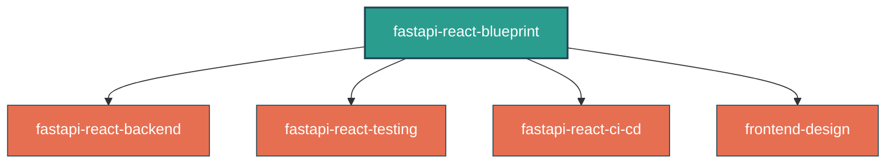

# Modern Stack Architecture & Design Decisions

This skill encapsulates the chosen technology stack, core architectural guidelines, and serves as an entry point for developer/agent workflows. 

## 1. Chosen Technology Stack & Rationale

| Technology | Purpose | Why We Chose It |
|---|---|---|
| **Python (FastAPI)** | Backend & Orchestrator Daemon | Python is the standard for AI/agentic tooling. FastAPI provides immense speed, asynchronous support, and native OpenAPI/Swagger generation. |
| **Astral Tooling (Ruff, UV, Ty)** | Static Analysis & Execution | We exclusively use Astral tooling for the Python ecosystem: `ruff` for lightning-fast linting/formatting, `uv` for package management, and `ty` for extremely fast, Rust-based static type checking. |
| **Frontend Architecture** | **React Router v7 (SPA Mode)** | Provides a robust, lightweight frontend architecture. For **all applications** where SEO and Server-Side Rendering (SSR) are unnecessary, always initialize using React Router v7 in SPA Mode (`npx create-react-router@latest` -> SPA). This provides Remix's powerful `loader`/`action` paradigms without the heavy Node server overhead. **Tailwind v4 & shadcn/ui**: All UI components must use the `frontend-design` skill aesthetic. Tailwind v4 must be the CSS engine. |
| **PostgreSQL & SQLModel** | Database Persistence | PostgreSQL is the most robust open-source relational database. **Always use the latest stable major version** (e.g., `postgres:18-alpine`). SQLModel (by the creator of FastAPI) combines SQLAlchemy 2.0 and Pydantic into a single class, eliminating the need to duplicate schemas for the API and the Database. |
| **Testcontainers** | Spec-Driven Acceptance Tests | Allows us to spin up isolated PostgreSQL databases and FastAPI servers in Docker containers during testing, ensuring zero state bleeding between tests. |
| **PyInstaller (Optional: Inno Setup)** | Cross-Platform Distribution | Bundles the entire Python daemon, dependencies, and React static assets into a single native binary (macOS/Linux/Windows) for non-technical users. Windows builds can optionally use Inno Setup to compile a professional `.exe` setup wizard. |
| **Docker Compose & Make** | Local Developer Experience (DX) | We enforce `docker-compose.yml` profiles (`profiles: ["full"]`) so that `docker compose up -d` only provisions the database. We use a `Makefile` to abstract the DX: `make dev` uses `npx concurrently` to boot the database and stream both the native Python and React hot-reloading servers in a single, unified terminal. |

---

## 2. Progressive Disclosure Navigation Guide

Depending on the phase of development you are executing, load and adhere to the corresponding specialized sub-skill:

### Backend Code & Infrastructure
* **Focus**: Hexagonal architecture adapters, CQRS, SQLite/PostgreSQL schema configuration, external API rate-limiting/permission tolerance, subprocess logging and observability, disk leaks, and stale caching unit tests.
* **Action**: Load and follow the [fastapi-react-backend](skills/fastapi-react-backend/SKILL.md) skill.

### Testing & Quality Assurance
* **Focus**: Writing Vitest UI tests, configuring Testcontainers with virtualization timeouts, building state-based `respx` fakes instead of mocks, writing Playwright smoke tests, and Visual Regression Testing (VRT).
* **Action**: Load and follow the [fastapi-react-testing](skills/fastapi-react-testing/SKILL.md) skill.

### CI/CD Pipelines & Dev Velocity
* **Focus**: Dual-path testing loops (unit tests run locally vs integration on CI/CD), avoiding redundant test runs on merge-to-main, and running fast typecheck/lint jobs early on pull requests.
* **Action**: Load and follow the [fastapi-react-ci-cd](skills/fastapi-react-ci-cd/SKILL.md) skill.

### UI Styling & Layout
* **Focus**: Implementing the Industrial / Utilitarian Control Panel aesthetic, using Tailwind CSS v4, and customizing shadcn/ui.
* **Action**: Load and follow the [frontend-design](file:///C:/Users/aivon/.gemini/config/skills/frontend-design/SKILL.md) skill.

---

## 3. General Project Guidelines

* **Core Philosophy (`karpathy-guidelines`)**: Simplicity First and Surgical Changes. We write the absolute minimum code required to solve the problem. Zero speculative features. We only touch the code we must touch.
* **Security Auditing (`shannon`)**: Trigger this skill at any time to run white-box security assessments and execute real exploits to prove that the application is secure.
* **Supply Chain Security**: All dependencies in `pyproject.toml` and `package.json` **MUST** be pinned to exact versions (e.g., `fastapi==0.136.1` instead of `>=`). Lockfiles (`uv.lock`, `package-lock.json`) **MUST** be committed to version control. Default to the latest stable major version of backing services (e.g. Node.js LTS, PostgreSQL 18).
* **TypeScript version**: Use the latest stable TypeScript version officially supported by the installed ESLint toolchain to ensure peer dependency alignment.
* **Docker Security**: Always use `slim` or `alpine` variants for Docker base images (e.g., `python:3.12-slim`, `postgres:17-alpine`) to minimize footprint and reduce vulnerability exposure.
* **OpenAPI Autogeneration (`openapi-typescript`)**: Enforce 100% type safety across the frontend/backend boundary. Instead of brittle, manual interface definitions, the React frontend must generate its schemas directly from FastAPI's `/openapi.json` to prevent schema drift and catch API contract breakages at compile-time.
* **Documentation & Demos**:
  * Use [excalidraw-diagram](file:///C:/Users/aivon/.gemini/config/skills/excalidraw-diagram/SKILL.md) to generate system architecture diagrams.
  * Use [remotion-best-practices](file:///C:/Users/aivon/.gemini/config/skills/remotion-best-practices/SKILL.md) to programmatically generate demo videos of the application.
